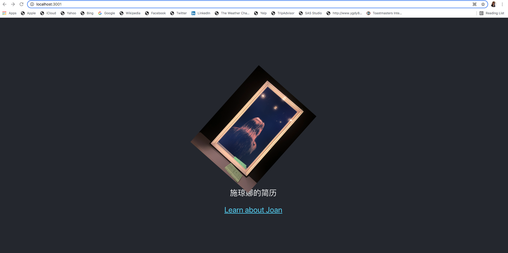

# :icecream:Typescript_Playground
Dear Typescript, are you the future hero or not?

### Create React App: 
https://create-react-app.dev/docs/getting-started

### Development: 

### Add TypeScript: 
https://create-react-app.dev/docs/adding-typescript/

### Add type definitions for react-bootstrap: 
https://www.npmjs.com/package/@types/react-bootstrap

### Play around React-Bootstrap TypeScript: 
https://codesandbox.io/s/github/react-bootstrap/code-sandbox-examples/tree/master/basic-ts?file=/src/App.tsx

### Introduce react-icons: 
https://react-icons.github.io/react-icons/

### Introduce Button and Toasts Components:
https://react-bootstrap.github.io/components/buttons/
https://react-bootstrap.github.io/components/toasts/

### Deploy to GitHub Pages: 
https://create-react-app.dev/docs/deployment/

### Serving as Joan's simple Name Card - version 1.0:

### Keep using build pipeline and deploying the changes: 
Keep using build pipeline and deploying the changes to the production site to make it looks nicer through different devices. 